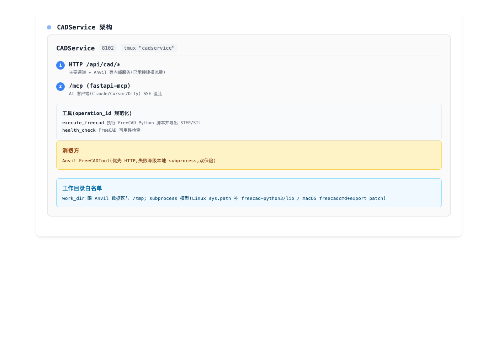

# CADService — FreeCAD 统一执行层(端口 8102)

> DesignTool 胶水层成员:FreeCAD 路线唯一引擎,服务常驻免冷启动。
> 前移自 /mnt/data/develop/mcp_servers(2026-08);build123d(geom_mcp)
> 路线经评估终止(能力为 Part API 子集且零消费方),归档 mcp_servers.bak。

## 架构

CADService 采用双通道设计，同时满足内部服务调用和AI客户端直连：

### 架构特点

- **双通道服务模式**:
  - HTTP通道 (`/api/cad/*`): 主要服务调用通道
  - MCP通道 (`/mcp`): AI客户端直连通道
- **服务消费方**: 主要由Anvil的FreeCADTool调用
- **工作目录**: 白名单限Anvil数据区+/tmp
- **降级机制**: HTTP失败时自动降级本地subprocess执行

### 工具列表

| 工具名 | 功能 |
|--------|------|
| `execute_freecad` | 执行FreeCAD Python脚本，导出STEP/STL |
| `health_check` | FreeCAD可用性检查 |

## API

| 端点 | 说明 |
|---|---|
| GET /api/cad/health | FreeCAD 可用性 |
| POST /api/cad/execute | {code, work_dir?, timeout?} → {ok, files, stdout, elapsed} |

work_dir 白名单限 Anvil 数据区与 /tmp;subprocess 模型(Linux
sys.path 补 freecad-python3/lib / macOS freecadcmd+export patch)。

## 启动

tmux: `PYTHONPATH=/usr/lib/freecad-python3/lib:DesignTool根 python3 -m cadmcp.api --port 8102`
或 `./start.sh`;日志 logs/cadservice.log。

## 在三层战略中的位置

胶水层核心:把 FreeCAD(OCC)的建模执行封装为 AI 可用的常驻服务;
未来设计原语体系(Primordium 可执行载体)的几何生成后端。

