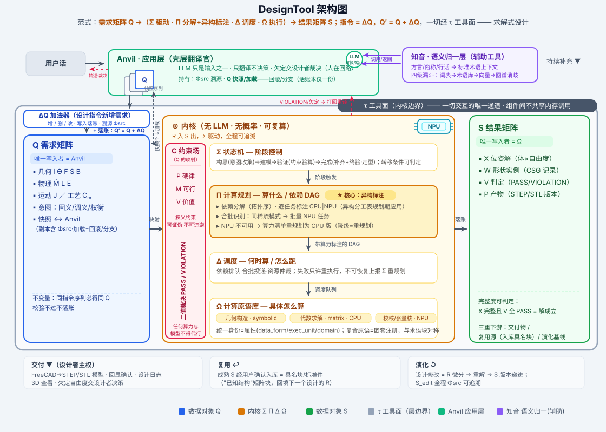

# DesignTool 架构定义 V0

> 版本: V0.5（2026-09-04 更名：Primordium 结构定义 → DesignTool 架构定义；Primordium 是 DesignTool 的内核核心，非全部）
> 上位: 《技术框架规划.md》（Metaconstructor/异构分工表/四层约束）、《设计指令矩阵表示_V0.md》、《需求矩阵Q定义_V0.md》、《约束场设计系统_总体蓝图.md》（Q→S 范式）
> 一句话: **需求矩阵 Q →[Primordium 内核: Σ驱动 · Π分解+异构标注 · Δ调度 · Ω执行]→ 结果矩阵 S，一切经工具面 τ**；设计指令 = ΔQ，Q′ = Q + ΔQ

---

## 零、总图



> 范式：**Q →（Σ 驱动 / Π 分解+异构标注 / Δ 调度 / Ω 执行）→ S**，一切经工具面 τ
> 类比：Primordium 内核 = 设计计算的操作系统——Σ 进程状态 · Π 程序 · Δ 调度器 · Ω 指令集；Q 输入，S 输出，τ 系统调用

### DesignTool 架构层次

```
DesignTool
├── 应用层
│   ├── Anvil · 壳层翻译官（LLM 翻译 ΔQ，不决策；Q 快照/加载；Φsrc 溯源）
│   └── 知音 · 语义归一层（方言→标准术语，四级漏斗，辅助工具）
├── Primordium 内核（无 LLM · 无概率 · 可复算）
│   ├── 数据对象  Q 需求矩阵（输入）· S 结果矩阵（输出）
│   ├── 内核四件套  Σ 状态机 · Π 计算规划 · Δ 调度 · Ω 计算原语
│   ├── C 约束场   P 硬律 · 𝒞ₘ 可行 · 𝒞ᵥ 价值 · 𝒞_c 条件（适定）
│   ├── 知识矩阵  EG 专家指导 · RV 评审
│   └── 记忆 M    工作记忆(Q/S) · 长期记忆(EG/术语/历史)
└── τ 工具面（层边界，一切交互的唯一通道）
```

> **SVG ↔ 本文对照**：SVG 以六组件为视觉骨架（Anvil / Q / 内核(ΣΠΔΩ+C) / S / τ / 知音），本文按逻辑层次展开——§一~二（Q/S 数据对象）§五~九（ΣΠΔΩ 内核四件套）§十~十.5（C 约束场+稳定性）§三（EG/RV 知识矩阵）§四（记忆 M + 知音）§十二（τ 工具面）。Anvil 与知音属应用层/辅助层，本文交叉引用（§1.1 Anvil 写入者、§4.1 知音接入、§十二 τ 面表），详细规格见各自文档。

---

## 一、数据对象：需求矩阵 Q（内核的输入）

### 1.1 记号与增量定义

- **记号约定：需求矩阵 = Q；设计指令 = ΔQ**——一条用户指令就是 Q 的一个增量，**Q′ = Q + ΔQ**（2026-09-02 定调）
- 设计会话 = 增量序列：Q_n = Q₀ + ΔQ₁ + … + ΔQₙ；回滚 = Q + (−ΔQᵢ)——取逆增量后**仍经 ΔQ 加法器落账**（"−"是加逆元的记法简写，非独立运算；加法器「删」型算子即逆元的实现）
- 组成：五套矩阵（几何 I Θ F S B｜物理 M̂ L E｜运动 J｜工艺 Cₘ｜意图三工具）+ 溯源 Φsrc
- **ΔQ 写入者唯一 = Anvil**（LLM 翻译任务精确化为：用户话 → 一个合法的 ΔQ）：
  - 合法性：词汇∈表 + 可挂载（引用的 body id ∈ Q）
  - 可逆性：每个 ΔQᵢ 存在逆元（增↔删、改↔改回），Q + (−ΔQᵢ) = 精确回滚——全程只用了 +
  - 可追溯：每个 ΔQ 携带 [指令号, 用户原文指纹]；**指令追溯沿用 Anvil design_log（seq=指令号），Φsrc 与之对接，不另造**
- 不变量：同指令序列必得同 Q（确定性累积）

### 1.2 Q 的代数：定义 + 运算

**ΔQ 结构** = 有序运算列表 `[op₁, …, opₖ]`，按序施加，**原子事务**（任一 op 失败 → 整体回滚不落账，报出失败 op 与原因，打回 Anvil 重译）。

**三型原语**（对应 SVG "增 / 删 / 改"，全系统只有一个运算：+）：

| 原语 | 记号 | 定义 | 前置条件 | 级联 |
|---|---|---|---|---|
| 增 | Q ⊕ add(e) | 新增体/关系/特征/意图条目 | 新 id ∉ Q；引用 id ∈ Q | 无 |
| 改 | Q ⊕ upd(e, k→v′) | 元素字段 v → v′ | e ∈ Q；v′ 合法；不违反意图保护 | 受影响 S 行标 stale → 重解 |
| 删 | Q ⊕ del(e) | 移除元素（= 增的逆元 −ΔQ） | e ∈ Q；无意图保护锁 | 级联删关系/特征/参数（清单报用户） |

**复合运算**（三型的组合，非独立运算）：

| 复合 | 记法 | 展开 | 触发 |
|---|---|---|---|
| 清 | Q := Q₀ | = 逐条删（逆序 del 全部）| 用户明示"重新设计" |
| 回滚 | Q ← Qᵢ | = 逆放 ΔQᵢ 的逆元序列 | 按增量日志精确回到第 i 条前 |

> "−"只是记法简写——删即增的逆元，改即"删旧+增新"的简写，清/回滚即删的组合。代数保证：每个 ΔQ 存在逆元（增↔删、改↔改回），故回滚 = Q + (−ΔQᵢ)，**全程只用了 +**（对齐《需求矩阵Q定义_V0.md》§一）。

**apply 执行语义**：legality(ΔQ,Q) → 逐 op 施加（原子性）→ 后置完整性检查（无悬空引用）→ 落账三件套 (Q_before, ΔQ, Q_after) + Φsrc + 触发重解。

**版本链 = 设计历史**：Q₀ ─ΔQ₁→ Q₁ ─ΔQ₂→ …（节点 = 版本+增量+指令号+时间），S 随 Q 版本递进。

**ΔQ 三来源**（写入口唯一 = Anvil 翻译器）：ΔQ_user（指令翻译）／ΔQ_block（术语块/标准件挂载，块=预制合法 op 列表）／ΔQ_intent（意图三工具条目）。

### 1.3 双区结构：Q = Q1（设计加入，强）+ Q2（系统规范化完善）

> **实现原则：归类通过属性标识，不影响结构表示。** Q1/Q2 不是两张矩阵——条目带 authority 属性（strong/derived）；维度、来源、阶段、状态同样是属性标签。结构表示（五套矩阵）恒定；归类 = 属性过滤视图。结构不分表，运算不分家。

**条目属性 schema**：

```
entry := { value,
  authority: strong | derived,   # 强(Q1)/弱(Q2)
  dimension: geom|phys|motion|manuf|intent|org,
  source: inst#N | rule#M,
  status: active | stale,
  confirmed: bool }              # Q2 确认升格后置 true
```

| | Q1 设计加入（强） | Q2 系统规范化完善（弱·可再生） |
|---|---|---|
| 内容 | 用户指令显式表达的需求 | 让 Q 完整、规范、可求解的条目（非外加内容） |
| 例 | Ø100 空心球、承重 500kg | 单位/坐标系默认、锚定 z=0、国标圆整、缺省 Cₘ |
| 写入者 | Anvil 翻译 ΔQ_user | 规范化器（随 Q1 变化重算） |
| 溯源 | 指令号 | 规则号 |
| 权威 | 系统不可修改 | 可重建/剪枝；不得违反 Q1 |

**四条权威规则**：①服从（冲突时 Q1 恒胜，冲突报 VIOLATION）②重建（惰性/增量：仅受影响子图，防计算风暴——DP 评审采纳）③升级（用户确认 Q2 → 升格 Q1，确认即立法）④不越权（Q2 只做规范化/默认/圆整，欠定自由度仍必报用户）。

**apply 两段式**：legality → 落 Q1 → 规范化器重算 Q2′ = norm(Q1) → 完整性检查 → 落账 → 触发重解。

- 现状：V0 原型已通；五套矩阵 V1 分批（几何先行）

---

## 二、数据对象：结果矩阵 S（内核的输出）

```
S = [ X 位姿解(体×自由度) | W 形状实例(零件×CSG演算记录)
      V 判定(约束×PASS/VIOLATION+数值) | P 产物索引(STEP/STL,版本,step_id) ]
```

- **写入者唯一 = Ω**（与 Q 恰好对称：Q 由 Anvil 写，S 由 Ω 写，中间无人）
- 不变量：可复算（同 Q 必得同 S）；双向追溯（S→Π 步骤→Q 需求）；完整度可判定（X 完整且 V 全 PASS = 解成立）
- 三重下游身份：交付物（前端 3D/STEP）｜复用源（成熟 S 入库 = 具名块/标准件）｜演化基线（修改 = Q 微分(ΔQ) → 重解 → S 版本递进）
- **两级解**：预览解（随 ΔQ 自动，快、允许部分/近似，WYSIWYG）｜交付解（S4，精确 STEP/全量判定）
- **追溯沿用 Anvil 既有设计**：design_log 序号/每步产物目录/rollback/任务状态注册表照旧；Φsrc.inst#N ↔ design_log.seq 对接，不另造
- 与 Σ 耦合：S 完整度是转移条件（X 完整→进入验证；V 全 PASS→交付）
- 现状：隐式（build 产物 + design_log），V1 显式化

---

## 三、配套知识矩阵：EG 专家指导 + RV 评审（知识侧·评价侧）

### EG 专家指导矩阵（知识侧·全局共享）
- 定位：专家知识/启发式/典型结构——**指导**设计决策与 Q2 完善；不做判定
- 条目：`{ context 适用条件, guidance 指导(建议值/典型结构块/规则), weight 强度, source 手册|国标|专家|历史设计 }`
- 三条作用通道：①Q2 完善建议（用户确认升格 Q1）②Π 规划提示（悬臂→建议加筋）③RV 评审项来源
- 来源底座现成：mech_terms + GbstdService 国标库 + (Q_i,S_i) 历史设计对 + 专家条目；检索走 NPU embedding——只出建议，落 𝒞ᵥ 层

### RV 评审矩阵（评价侧·模板全局＋实例会话级）
- 定位：结构化评审 S——质量门禁第二层（constraints 管硬判定；RV 管合理性/经济性/人机/美学，𝒞ᵥ 层）
- 模板（全局）：`{ criterion, aspect, rubric, weight, reviewer(AI persona|人类) }`；实例：模板 × S → review_report `{ score, issues[], pass }`
- 闭环：issues → ΔQ 建议清单（用户确认后落账）或 request_tool 能力缺口——矩阵化升级 Anvil ReviewManager 既有循环
- 铁律：RV 意见**不覆盖** 𝒫/𝒞ₘ 判定；**EG/RV 建议落 ΔQ 须带置信度，低置信不自动落账**（DP 评审采纳）

### 三矩阵协同一句话
**EG 告诉系统"专家会怎么做"，Q 记录"用户要什么"，RV 检查"做出来的怎么样"**——EG 喂 Q2 与 RV 项；RV findings 回流为 ΔQ；𝒞ᵥ 全程不越权。

---

## 四、记忆与检索 M（RAG 为现形态）

新范式AI 认知六件套：语言（Anvil LLM）／推理（约束内核）／规划（Π）／进化（Ω+飞轮）／**记忆（M）**／工具（τ）。

```
工作记忆 = Q/S 本身（会话态，矩阵化——增量代数 Q′=Q+ΔQ 的物理意义）
长期记忆 = EG + 术语块库 + 历史(Q,S)对 + 翻译句对库（全局共享）
检索机制 = 向量相似度（NPU embedding）× 结构化属性过滤（authority/dimension/…，同 §1.3）
```

四个消费方：①语言智能：few-shot 句对检索→翻译准确率 ②进化智能：EG 相似建议与历史设计复用 ③Q2 完善：规范化规则知识来源 ④RV：评审项来源。

实现底座现成：kbservice(8104) + Anvil rag backend + mech_terms/GbstdService。V1 接线与命名，V2 加 NPU 向量化。

### 4.1 知音 · 语义归一层（SVG 六组件之一 · 辅助工具）

> SVG 定位：Anvil 调用的语义归一辅助工具，τ 边界之外——"方言/俗称/行话 → 标准术语上下文"，四级漏斗：词表→术语库→向量→图谱消歧。详见《语义数值映射定义_V0.md》§七。

- **职责**：用户话 → 标准术语上下文 JSON（terms/mapping/constraints/questions），Anvil LLM 只基于归一化后的 JSON 落 ΔQ——LLM 见到的是标准词，不再直面方言
- **与 M 的关系**：知音是 M 的语义检索前沿——词表(vocabulary.json) → MySQL 术语表 → RAG 向量 → 图谱消歧，复用 M 的检索底座
- **个性化**：知音·记 维护用户级偏好（惯用说法/默认材料/常用尺寸），只影响语义面排序与 Q2 缺省值，数值面枚举与 id 恒定
- **现状**：未启动独立组件；`Anvil/anvil/prompts/mech_terms.py` 是 prompt 侧术语表（非归一层），V1 落地

---

## 五、Primordium 内核四件套总述（Σ Π Δ Ω）

| 组件 | 问题 | 输出 | 类比 OS |
|---|---|---|---|
| Σ 状态机 | 设计走到哪个阶段了？ | 当前阶段 + 转移触发 | 进程状态 |
| Π 计算规划 | 算什么、按什么依赖、**哪些在 CPU 哪些在 NPU**？ | 带算力标注的任务 DAG | 程序(含编译目标) |
| Δ 调度 | 何时启动、怎么排队合批、资源冲突怎么办？ | 执行队列与完成回执 | 调度器 |
| Ω 计算原语 | 具体怎么算？ | 执行结果（写 S） | 指令集 |

- 内核不含 LLM、不含概率；转移条件/分解规则/放置策略全是确定性代码
- 内核无状态（状态都在 Q/S 里）——可重启、可复算、可水平扩展

---

## 六、Σ 状态机（阶段控制）

```
S0 需求收集 ──Q适定(rank检查)──► S1 概念求解 ──解算成功──► S2 建模执行
   ▲                              │欠定/冲突                 │
   │                              ▼(交用户补自由度/裁决)      ▼ build ok
   │                                                    S3 验证判定
   └──────────── S_edit 增量修改(回S1,Q微分)               │PASS / VIOLATION
                                                         ▼        │
                                               S4 交付(S 落账) ◄───┘
```

> **SVG 对照**：SVG 的 Σ 框画四阶段"构思(意图收集)→建模→验证(约束验算)→完成(补齐+终验·定型)"，对应本文 S0–S4 的简化展示——构思=S0+S1（宏观），建模=S2（通道），验证=S3（宏观），完成=S4（宏观）。SVG 四框 = 三宏观 + S2 通道；本文 S0–S4 五状态 = 可判定转移的完整实现。

- **三大宏观阶段（2026-09-02 定调，用户/前端视角）**：**构思**（S0+S1，设计意图的收集）→ **验证**（S3，严格约束验算）→ **完成**（S4 前补齐全部设计 + 终验 = **设计定型**）；S2 建模执行是意图落几何的通道。宏观阶段是展示语义，S0–S4 是可判定的转移实现——一层给人看，一层给机器跑
- **阶段 = 精度档位（算力管控机制，2026-09-02 定调）**：设计阶段本质是**计算精度的分级管控**，直接作为 Π 选型与 Δ 调度的输入——
  | 阶段 | 精度档 | Π 任务选型 | Δ 预算 |
  |---|---|---|---|
  | 构思 S0/S1 | 粗（闭式/线性化/轻量网格） | 预览解任务，秒级 | 高频小额，what-if 并行友好 |
  | 建模 S2 | 中 | 增量编译 stale 子图 | 随 ΔQ 走 |
  | 验证 S3 | 严格（完整约束验算/精确解） | 验证任务全开 | 一次性大额 |
  | 完成 S4 | 定型（全精度终验） | 终验+落账存档 | 终版一次，版本固化 |
  原则：**Σ 宣布阶段 → Π 按档选任务 → Δ 按档给预算**——既防"全程全精度"烧算力，也防"终版粗算"出事故
- 转移条件全部可判定：rank(A)、build status、𝒫/𝒞ₘ 判定——**状态机里没有 LLM**
- **所见即所得（2026-09-02 定调）**：任何阶段都可预览，不等定稿——每次 ΔQ 落账，Π 自动追加预览解任务（增量编译 stale 子图→快速求解→轻量网格，秒级）；交付解仅在 S4。欠定时预览照常：确定子图正常显示，未定自由度占位+高亮——预览不猜，也不空白
- 状态 = (阶段, Q 版本, S 版本, 最近判定)；对齐 Anvil 既有 project.phase 字段
- 现状：隐式（phase + design_log），待显式组件化

---

## 七、Π 计算规划（算什么 + 在哪算）

**核心产出 = 带算力标注的任务 DAG**：`[(任务, 算子, 参数, target=CPU|NPU, 依赖), ...]`。异构标注是规划期决策——**异构分工表在 Π 应用**，这是计算规划的核心内容。

- 输入：Q 快照 + Σ 阶段 + **算力清单**
- 规划规则（全部确定性）：
  1. **依赖分解**：关系拓扑序、按角色挂验证器、意图保护检查——语义 DAG
  2. **异构标注**：逐任务查分工表定 target（符号/图/稀疏索引/小规模解析/常规 CSG→CPU；大规模张量/批量右端 A·X=B(Θ)/CG 体/场迭代/批量干涉→**NPU**；规模阈值可配置——NPU 不做小活）
  3. **合批识别**：同稀疏模式任务组 → 合并为批量任务并标 NPU（识别在 Π——语义层才知道模式相同；执行在 Δ）
  4. **预览任务（WYSIWYG）**：每次 ΔQ 落账自动追加——增量编译 stale 子图→快速求解→轻量网格，前端即时可见
- 铁律：DAG 内不含设计决策 if；NPU 不可用时按算力清单重规划为 CPU 版（降级是重规划，不是运行时漂移）
- 现状：隐式（resolver 固定顺序），V1 显式化（先全 CPU 标注，V2 接入 NPU 清单）

---

## 八、Δ 调度（何时算/怎么跑）

- 输入：Π 的**带标注** DAG；输出：执行队列与完成回执
- 职责（不含算力决策——那已在 Π 完成）：①排序（依赖驱动启动时机）②合批执行（批量任务投递对应执行单元）③资源仲裁与重试（失败只许重执行不许改方案；不可恢复→上报 Σ 重新规划）
- 现状：无（任务直接跑），V2 随 NPU 显式化

---

## 九、Ω 计算原语库（具体怎么算）

**统一身份：一切可调用的最小计算单元都是"计算原语"**——几何构造（sphere/shell/subtract）、代数求解（稀疏装配/三角求解/零空间投影）、工程公式（板承重/销剪/梁弯）、张量核（批量CG/场迭代）。身份相同，差别只是**属性**，不是类别——算法不以"矩阵|非矩阵"划界：

| 属性（正交元数据，非分类轴） | 取值 | 用途 |
|---|---|---|
| data_form 数据形态 | symbolic / matrix / tensor | "矩阵与否"只是属性 |
| exec_unit 执行单元 | CPU / NPU | Π 异构标注依据（同一原语可双栖，按规模/可用性标注） |
| domain 领域 | geom / algebra / engcheck / field | 语义归类（属性视图，同 §1.3 原则） |

**构成法 = 算法原子化（2026-09-02 定名）**：一切算法分解为计算原语（原子），复杂算法 = 原子的嵌套组合——这是 Ω 的宪法：
- **复合原语** = 计算原子的嵌套组合并注册为新原语（如"空心球求解" = 装配 ⊕ 稀疏求解 ⊕ 零空间检查）
- Π 的执行流 DAG 就是嵌套关系的显式展开；复合原语注册后可再嵌套——**层级是长出来的，不是划出来的**
- 与设计侧完全对称：**术语块 = 设计原语的嵌套**（用户语言），**复合原语 = 计算原语的嵌套**（计算语言）
- 注册：(签名, 前置条件, 属性, 对应方程/公理)；新增原语=注册条目，Π/Δ/其他原语零改动
- 现状：几何原语(registry 17)与工程公式散件已有；统一注册表 + 复合原语机制 V1 落地

---

## 十、计算稳定性★（内核第一品质：同 Q 必得同 S）

需求矩阵迭代生长（Q₀→…→Qₙ），每一版结果必须稳定——**不允许这轮一个结果、下轮另一个结果**。五层保证：

1. **纯函数内核**：`S = sol(Q; v_registry, v_config)`——结果只依赖 Q 内容 + 原语注册表版本 + 求解配置（精度档/容差/最大迭代/归约顺序）。任一变动 → S 版本号变动并显式声明。禁止：墙钟时间、无种子随机、线程数影响结果、哈希遍历序影响输出序
2. **两级一致性**：语义一致（绝对：同 Q → 拓扑/判定结论/零空间维数完全相同，**判定不得翻转**）；数值一致（同硬件同配置→位级；跨硬件→声明 ε 内，写入凭据）。判定带缓冲：PASS 需 margin > ε_guard，边界情形输出 **BOUNDARY** 上报，不静默翻转
3. **路径无关**：不同 ΔQ 顺序到达同一 Q 内容 → 必得同一 S；增量重解必须收敛到与全量重解一致；关键节点**回放校验**，超 ε → `RE_SOLVE_MISMATCH`，停交付升级人工
4. **确定性收敛**：交付解冷启动（x₀=0，禁止 warm start 引入路径依赖；预览解可 warm start 但标注预览级）；固定迭代上限+固定容差+**固定归约树**（锁死并行归约顺序，浮点非结合性不构成漂移源）
5. **漂移监控**：S 版本链存求解凭据 `(Q_hash, v_registry, v_config)`；常态化回放（旧 Q 经当前内核重算 vs 存档 S），漂移即事件（`RE_SOLVE_MISMATCH`/`VERDICT_FLIP` → Σ 停交付人工介入）——与 INTENT_LOST 同族哨兵

**一句话**：S 是 Q 的数学函数，不是一次计算的历史——凡影响结果的每个因素必须显式进入凭据，凡凭据不变而结果变者，皆为必须上报的缺陷。★ 一票否决：本品质不成立，系统不成立。

---

## 十.5 验算 · 不可达判定 · 提示（判定层三补充，2026-09-02 定调）

**1. 验算（独立路径验证）**
- 求解与验算必须**算法异源**：CG 求解 → 直接法/区间法验算；CSG 构建 → 测量学验算（bbox/体积/干涉用独立算法）。同源验算 = 自证无效
- 验算结果带方法标签写入 S.V；验算不过 = `RE_VERIFY_FAIL` 事件（并入稳定性哨兵族）

**2. 不可达判定（UNREACHABLE——带证明的无解判定）**
- 三者区别：**VIOLATION** = 某硬约束违反（可能可修）；**BOUNDARY** = 临界（升格人裁）；**UNREACHABLE** = 联合证明当前 Q 无解（必须改需求）
- 手段：①区间收缩（约束传播推导必要条件，迭代收缩至空集 → 证明完备）②过定检测（b ∉ 列空间）③几何必要条件（如壳厚 < 半径）
- 输出：UNREACHABLE + **证明链**（最小冲突集：哪几条约束联合导致空集）——"违例即死，死也要有死亡证明"

**3. 提示（可操作修复建议）**
- 触发：验算失败 / VIOLATION / UNREACHABLE 时自动生成
- 手段：最小冲突集 → 参数敏感度扫描（区间端点解："t≤25 可行"或"Ø≥130 可行"）；EG 检索相似案例解法
- 纪律：提示 = `ΔQ_hint` 建议清单带置信度，**确认模式**（用户确认才落账，同 §十一 决策模式）

**非 PASS 事件全族**（每个事件必附 HINTS）：`VIOLATION / BOUNDARY / UNREACHABLE / INTENT_LOST / RE_SOLVE_MISMATCH / RE_VERIFY_FAIL`

### C 约束场 · 层次与 SVG 对照

> **SVG 对照**：SVG 的 C 约束场画三层"P 硬律 / M 可行 / V 价值" + "二值裁决 PASS / VIOLATION" + "任何算力与模型不得代行"。

| SVG 标注 | 文档符号 | 全称 | 说明 |
|---|---|---|---|
| P 硬律 | 𝒫 | 物理硬律 | 物理定律/几何不可违逆约束 |
| M 可行 | 𝒞ₘ | 制造可行 | 工艺能力不等式（壁厚/深径比/圆角…） |
| V 价值 | 𝒞ᵥ | 价值评价 | 成本/美学/寿命权衡（只允许在此层，禁止反哺 𝒫/𝒞ₘ） |
| （隐含于 Σ） | 𝒞_c | 条件约束 | 适定性判定（rank/DOF），是 Σ 状态转移的依据，SVG 未单列 |

- SVG 的"PASS / VIOLATION"是二值裁决核心；本文扩展为四态：PASS / VIOLATION（可修）/ UNREACHABLE（带证明无解）/ BOUNDARY（临界升人裁），见下节
- SVG 的"任何算力与模型不得代行"= 本文 §十 稳定性品质的铁律（内核无 LLM · 无概率 · 可复算）

### 强约束二值律（2026-09-02 定调）

对强约束（𝒫/𝒞ₘ/Q1），结果空间**只有两个合法终态**：

```
遵守  —— 已证明：解区间完整落入可行域（带验算凭据）
不可达 —— 已证明：约束传播收缩至空集（带证明链：最小冲突集）
```

- **没有第三态**："近似满足""基本符合""大概率可行"都是非法输出
- 中间态（区间骑线、无法证明任一侧）= **BOUNDARY → 升级专家裁决**（决策模式），不是自动放行的借口
- 区间运算的硬件愿景与此律互为因果：硬件级区间界让"证明"更快，但律本身在软件层已成立

---


稳定性约束内核不许掷骰子，**不排斥人**。人的决策以两种可追溯形态进入：①**决策即增量**（专家选择落为 ΔQ，记入增量日志）②**政策即约束**（专家预置策略，内核在其内自动执行）。同 Q + 同决策序列 → 必得同 S：**专家是扩展输入空间的一部分，不是随机源**。

| 模式 | 谁拍板 | 例 | 记录形态 |
|---|---|---|---|
| 自动 | 内核确定性规则 | 适定直接求解、Q2 规范化完善 | 求解凭据 |
| 确认 | 系统提议 + 用户批准 | Q2 升格 Q1、EG 建议、回显确认 | 确认事件 → ΔQ |
| 专家裁决 | 人在显式决策点上选 | 欠定自由度、BOUNDARY、rel 冲突、RV issues | 裁决 → ΔQ/政策 |
| 托管 | 专家预先定政策 | 评审模板、意图权重、规范化规则、阈值 | 政策版本（进凭据） |

铁律：**系统不隐性替人决策**（欠定必报、歧义必问、BOUNDARY 必升）；**人决策必经显式接口**（不进求解器暗状态）。

---

## 十二、工具面 τ（接口层，MCP-native）

组件之间、Primordium 对外的**唯一交互方式**——组件间不共享内存调用：

| 面向 | 形式 | 例 |
|---|---|---|
| LLM/Anvil | MCP 工具 | design_sentence / resolve / compose / query_standard |
| 服务间 | HTTP（MCP 同构） | 8103 → 8102 |
| 前端 | REST + SSE | 回显/设计日志/任务状态/3D 产物 |
| Δ→Ω | 原语即工具 | 注册计算原语可被执行队列直接调用 |

**τ 协议声明：MCP-native**——LLM→内核、内核→内核全走 MCP；任何 MCP 兼容 LLM/Agent 可直接接入生态。原则：工具无状态、输入输出全 JSON 可追溯。现状：MCP 面已通（8103/8102）。

---

## 十三、协同走查（空心球）

```
1. 用户话 → Anvil 翻译为 ΔQ → Q ← Q+ΔQ（落账[球/板/贴合]，溯源#1）
2. Σ: rank(A)=6/6 适定 → S0→S1
3. Π: 分解+异构标注 DAG [装配→求解→壳演算→build→板承重校核]（拓扑序板先于球；全 CPU——千件/规格扫描才标 NPU 批量）
4. Δ: 依赖排队，逐条投递执行单元
5. Ω: 逐条执行 → 位姿 z=70 写入 S.X；STEP 落盘 → S.P；σ≪σy → S.V=PASS
6. Σ: X 完整 + V 全 PASS → S4 交付
7. τ: 前端拿 3D + 演算轨迹 + 状态流转；S 成熟 → 入库具名块；复合计算原语同理入库复用
```

---

## 十四、与上位体系映射

| DesignTool | 上位文档概念 |
|---|---|
| Q / S | 四元组 𝕋𝔾ℬℱ 的输入/输出实例化 |
| Σ | 𝒞_c 条件约束（适定性决定"物理定律能否开始描述"） |
| Π + Δ | **Metaconstructor**（Π 分解+异构标注，Δ 下发各执行单元） |
| Π 异构标注 | 异构分工表 |
| Ω | 执行单元的三级属性化（symbolic/解析/张量） |
| τ | "所有异构资源访问必须经由调度" 的接口化 |

---

## 十五、现状对照与演进

> 下表"现状"列标注的是**有意纵切的阶段性简化**（快速验证可行），非对设计目标的否定。"下一步"是收敛计划。

| SVG 组件 | 现状（实然） | 下一步（应然） |
|---|---|---|
| Anvil 应用层 | ✅ LLM 翻译 q_apply + Φsrc 溯源 + Q 快照/加载 | VIOLATION 回路闭环；知音接入 |
| 知音 语义归一层 | ❌ 未启动（mech_terms 是 prompt 侧，非归一层） | V1 独立组件，四级漏斗落地 |
| Q 需求矩阵 | ⚠️ 纵切面：扁平 entries(inst/param/feat)，V0.1 词表 3 kind+1 feat | 五套矩阵 V1（几何先行），Φsrc 全量 |
| ΔQ 加法器 | ✅ 三型(add/upd/del) + 校验 + 落账 | ΔQ_block 术语块；区间意图 |
| Σ 状态机 | ⚠️ 隐式（phase+design_log） | 显式组件化，转移接 rank 诊断 |
| Π 计算规划 | ⚠️ 隐式（resolver 固定拓扑序） | DAG 生成器 + 异构标注（分工表落 Π） |
| Δ 调度 | ❌ 无（任务直接跑） | V2 随 NPU 调度（排队/合批/资源仲裁） |
| Ω 计算原语 | ⚠️ 散件：registry 17 几何原语 + 工程公式 | 统一注册表 + 复合原语嵌套 V1；NPU 核 V2 |
| C 约束场 | ⚠️ 部分：hard/feas/value 校验 + PASS/VIOLATION | UNREACHABLE 证明链 + BOUNDARY + 验算异源 |
| S 结果矩阵 | ⚠️ 隐式（产物+design_log） | 显式结果矩阵（X/W/V/P） |
| τ 工具面 | ✅ MCP 已通（8103/8102） | 原语统一注册为工具；Anvil↔知音 τ 化 |
