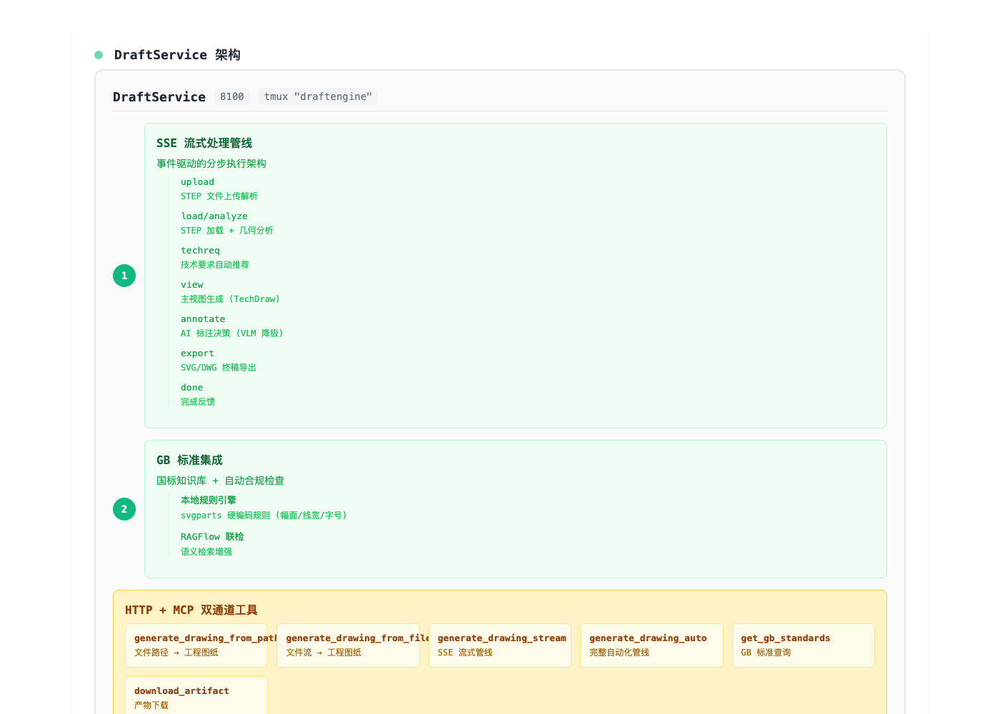

# DraftEngine — 3D 模型 → 工程图纸自动化服务

> 基于 FreeCAD + FastAPI + MCP，提供 REST API 和 MCP 工具接口，一键从 STEP 模型生成符合国标（GB）的三视图工程图纸（含总体尺寸标注）。
>
> **DesignTool 胶水层成员**(8100):HTTP+MCP 一体(fastapi-mcp,工具名
> operation_id 规范化:`generate_drawing_from_file/stream/auto` 等)。
> 国标知识库(gbstd/10 节规则)+ 图纸级合规自检(audit)是本项目特色;
> 知识资产本体建在 RAGFlow,经 kbservice(8101)联邦查询。



---

## 🎯 功能概述

- 接收 **STEP / STP / IGES / BREP** 格式的 3D 模型文件
- 自动生成 **A4 横向** 图纸，按 **第一角投影法（国标 GB/T 17452）** 布局 **主视图（Front）、俯视图（Top，主视图正下方）、左视图（Left，主视图正右方）**
- 自动标注 **长、宽、高** 总体尺寸，以及孔位 / 孔径（含沉头孔、同规格分组 `4-Φ10`）；轴类零件自动切换轴类专用视图（分段直径 + 总长）
- 输出 **SVG 矢量图**（可直接嵌入网页预览）、**PDF** 文件（cairosvg / rsvg-convert / inkscape 逐级降级）和 **FCStd**（FreeCAD 原生文档，可继续编辑）
- 附带结构化 **meta**（JSON：零件分类、包围盒、孔特征、尺寸清单），供 AI Agent / 前端解析
- 提供 **REST API**（端口 `8100`）和 **MCP 工具接口**（`/mcp`），便于 AI Agent 或前端集成
- 提供 **CLI**：`python -m draftengine.cli part.step -o out.svg --json meta.json`

---

## 📁 项目结构

```
DraftEngine/
├── draftengine/
│   ├── __init__.py
│   ├── api.py              # FastAPI 应用，挂载 MCP
│   ├── core.py             # generate_drawing() 核心函数 + PDF/FCStd 导出
│   ├── geometry.py         # 几何计算（FreeCAD/OCC：BoundBox、圆柱面、投影）
│   ├── features.py         # 特征识别（通孔/盲孔/沉头孔/轴段）+ 零件分类
│   ├── svgparts.py         # 表达层：图框/标题栏/尺寸标注 SVG 片段
│   ├── cli.py              # 命令行入口
│   └── mcp_helper.py       # MCP 工具挂载（将 API 转为 MCP 工具）
├── requirements.txt        # Python 依赖
├── run.sh                  # 启动脚本（自动设置 FreeCAD 环境）
└── README.md               # 本文档
```

---

## 🖥️ 环境要求

- **操作系统**：Ubuntu 20.04 / 22.04（推荐）
- **Python**：3.8 ～ 3.11（确保与 FreeCAD 的 Python 版本兼容，本机为 3.10）
- **FreeCAD**：≥ 0.21（apt 安装 `freecad-python3` 即可，无需 GUI）
- **依赖包**：见 `requirements.txt`

---

## 📦 安装步骤

### 1. 安装系统依赖

```bash
sudo apt update
sudo apt install -y python3-pip python3-venv git build-essential freecad-python3
```

### 2. 确认 freecad 库可用

```bash
ls /usr/lib/freecad-python3/lib    # apt 安装位置
# 或 snap 安装: /snap/freecad/current/usr/lib/freecad/lib
```

### 3. 安装 Python 依赖

```bash
pip3 install --user -r requirements.txt
```

---

## 🚀 启动服务

```bash
./run.sh
```

默认监听端口 `8100`，可通过环境变量 `DRAFTENGINE_PORT` 修改。

服务启动后，可访问 `http://localhost:8100/docs` 查看 API 文档（Swagger UI）。

---

## 📡 API 接口说明

### `POST /api/drawing/from-file`

**上传模型文件**，生成图纸，返回 SVG 内容。

**请求**：`multipart/form-data`

| 参数 | 类型 | 说明 |
|------|------|------|
| `file` | 文件 | 模型文件（支持 `.step`, `.stp`, `.iges`, `.igs`, `.brep`） |
| `out_dir` | 字符串 | 输出目录（默认 `/tmp`） |
| `title` | 字符串 | 图纸标题（默认文件主名） |
| `project` | 字符串 | 项目名称（可选） |

**返回**：JSON

```json
{
  "svg": "/tmp/output_drawing.svg",
  "pdf": "/tmp/output_drawing.pdf",
  "fcstd": "/tmp/output.FCStd",
  "title": "my_model",
  "project": "",
  "svg_content": "<svg>...</svg>",
  "meta": { "part_type": "plate", "bounding_box": {...}, "holes": [...], "dimensions": [...] }
}
```

### `POST /api/drawing/from-path`

**使用服务器上已有的模型文件**生成图纸。

**请求**：JSON

```json
{
  "model_path": "/path/to/model.step",
  "out_dir": "/tmp",
  "title": "MyPart",
  "project": "ProjectX"
}
```

**返回**：同上。

### `GET /api/health`

健康检查，返回 FreeCAD 是否可用。

---

## 🤖 MCP 工具集成

本服务通过 `mcp_helper` 将 API 自动封装为 **MCP 工具**（Model Context Protocol）。AI Agent 可以通过 MCP 客户端调用。

- **MCP 端点**：默认挂载在 `/mcp` 路径（依赖 `fastapi-mcp`，未安装时静默跳过，HTTP 不受影响）

配置 MCP 客户端：

```json
{
  "mcpServers": {
    "draftengine": {
      "url": "http://localhost:8100/mcp"
    }
  }
}
```

---

## 🧪 测试示例

### CLI

```bash
python3 -m draftengine.cli part.step -o /tmp/drawing.svg --json /tmp/meta.json -t "底板" -p "项目A"
```

### 使用 curl 调用 API

```bash
curl -X POST http://localhost:8100/api/drawing/from-file \
  -F "file=@/path/to/model.step" \
  -F "title=TestPart" \
  -o result.json
```

返回的 JSON 中包含 `svg_content` 字段，可直接嵌入 HTML 或保存为 `.svg` 文件。

### 仅生成 SVG 并保存

```bash
curl -X POST http://localhost:8100/api/drawing/from-file \
  -F "file=@model.step" \
  -F "out_dir=/home/user/output" \
  | jq -r '.svg_content' > drawing.svg
```

---

## ⚙️ 高级配置

- **端口**：环境变量 `DRAFTENGINE_PORT`（默认 `8100`）
- **临时目录**：可修改 `out_dir` 参数，或设置 `TMPDIR` 环境变量
- **视图比例**：可在 `core.py` 中调整 `scale` 计算逻辑（自动或手动）

---

## ⚠️ 常见问题

### 1. `ImportError: No module named 'FreeCAD'`

- 确认 `freecad-python3`（或 snap 版 freecad）已安装
- 检查 `run.sh` 探测到的 `FreeCAD` 库路径是否正确
- `geometry.py` 也会自动补 `/usr/lib/freecad-python3/lib`、`/usr/lib/freecad/lib` 到 `sys.path`

### 2. 导出 PDF 失败（`pdf` 返回 `null`）

- PDF 导出链：`cairosvg` → `rsvg-convert` → `inkscape`，三者全不可用时降级为仅 SVG
- 服务器推荐：`pip3 install --user cairosvg`

### 3. 视图位置

- 第一角投影：俯视图在主视图正下方、左视图在主视图正右方（GB/T 17452）
- 自动布局基于 A4（2970×2100 页面坐标），自定义模板需调整 `svgparts.py` 常量

### 4. 尺寸数字重叠

- 目前标注总体尺寸 + 首孔孔位 + 孔径分组，后续可扩展特征尺寸识别，或人工调整

---

## 📌 后续扩展方向

- **智能尺寸标注**：结合 VLM 识别图纸截图，自动标注更多特征（孔距、孔径）
- **标题栏填充**：支持从请求参数或配置文件中读取图号、设计人等信息
- **批量处理**：支持 ZIP 打包多个模型批量出图
- **与"知音"模块集成**：通过自然语言控制图纸样式

---

## 📄 许可证

MIT

---

**让 AI 从设计意图直达工程图纸** — DraftEngine 是您自动化出图流程的得力助手。
