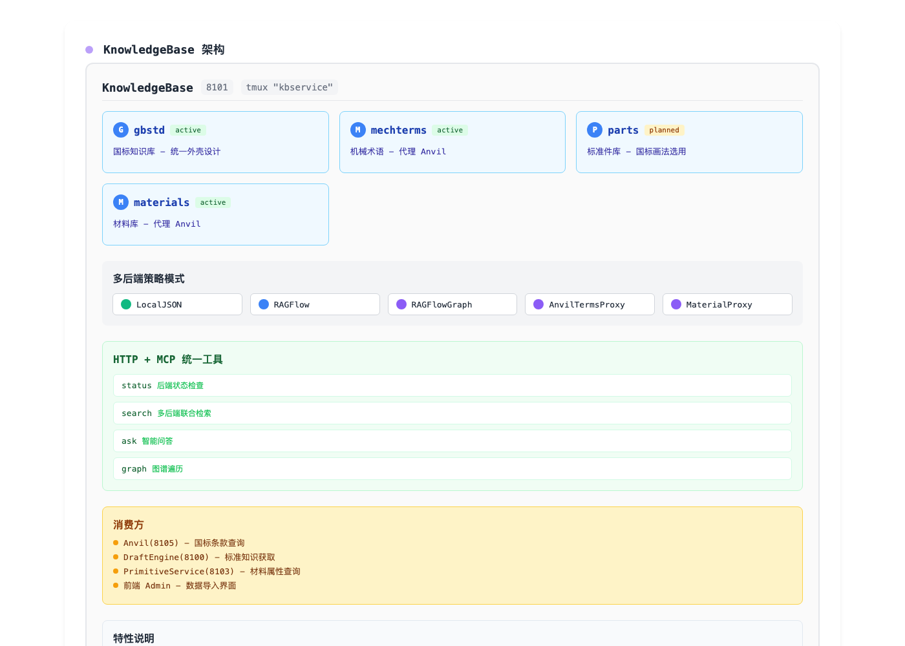

# KnowledgeBase — 独立知识服务(RAG + 知识图谱 + 规则库)

> DesignTool 胶水层成员(8101)。
> **数字资产定位**:知识本体建在 RAGFlow(知识库+图谱),
> 本服务是纯联邦查询 API,不存内容;`docs/` 仅是资料整理工作区。
> 消费方:Anvil Agent(query_standard/合规检查)、DraftEngine、任何 AI 客户端。



## 架构

```
KnowledgeBase (端口 8101)
├── kbservice/
│   ├── api.py          # FastAPI 入口 /api/kb/*
│   ├── core.py         # 域注册 + 多后端编排(加权合并,确定性优先)
│   ├── backends.py     # 后端策略:LocalJSON / RAGFlow / RAGFlowGraph / Anvil代理
│   ├── kg.py           # 本地知识图谱(邻接遍历)+ gbstd 种子图谱生成
│   └── domains/        # ★ 知识资产(数字资产本体)
│       └── gbstd/      # 工程图纸国标域
│           ├── *.json  # L1 规则层:10 节国标参数(渲染/审计共用,单源)
│           ├── docs/   # L2 文档层:标准目录 + 逐标准条款内容
│           │   ├── 00_CATALOG.md        # 39 项标准清单(P0/P1/P2,收录状态)
│           │   └── GB_T4458.4-2003/
│           │       ├── meta.json        # 溯源:来源/版本/是否替代/是否已推送
│           │       └── sections/*.md    # 自包含条款(首行强制【标准号·条款】)
│           ├── kg/      # 图谱:entities.json + relations.json
│           └── collect.py  # 采集管线:init / validate / push(入RAGFlow)
```

## 知识域(持续扩充)

| 域 | 内容 | 后端 |
|---|---|---|
| `gbstd` | 工程图纸国标(幅面/比例/图线/字体/尺寸注法/投影/公差...) | local + kg + ragflow |
| `mechterms` | 机械设计术语(通孔/贯穿孔/沉头孔...) | Anvil 代理 |
| `materials` | 标准件库(标准件/非标件/行业件/供应商) | Anvil 代理 |

新增域:在 `domains/` 放资产 + `core.py:default_domains()` 注册一行。

## API

| 端点 | 说明 |
|---|---|
| `GET /api/kb/status` | 域 + 后端健康 |
| `GET /api/kb/search?q=&top_k=&domain=&kinds=` | 检索;kinds=local,kg,ragflow,proxy 可过滤 |
| `GET /api/kb/ask?q=&domain=` | 检索增强问答(片段拼接) |
| `GET /api/kb/graph?entity=&domain=&depth=` | 图谱遍历(实体→邻居/边) |

前端经 vite 代理 `/kb-api/*`;LLM/Agent 直连 8101。

## 采集流水线(标准逐步添加)

```bash
cd KnowledgeBase && python3 -m kbservice.domains.gbstd.collect \
    {init|validate|push|list} [标准号]

# 1. init     按 00_CATALOG.md 建标准目录骨架(meta.json + sections/)
# 2. 写内容   sections/*.md,每节自包含:首行【GB/T 号 · 条款】,≤1500字
#            无原文时标"替代内容,待原文核对",meta.replacement=true
# 3. validate 断言头尾完整(不过禁止入库)
# 4. push     一节一文档入 RAGFlow(机制上杜绝跨条目切块)
```

**权威分级**:L0 官方原文(openstd.samr.gov.cn,非采标可下载,会话保护需浏览器)
→ L1 结构化规则(已入库,渲染/审计单源)→ L2 替代内容(显式降级标记,待替换)。

## 部署

```bash
# 任意主机(如 tmux 会话 kbservice)
KB_SVC_USER=xxx KB_SVC_PASS=xxx python3 -m kbservice.api --port 8101
# 环境变量:RAGFLOW_URL / RAGFLOW_API_KEY / RAGFLOW_DATASET(_GRAPH)
#          ANVIL_API(8095) / ADMIN_AUTH_URL(8097)
```

本地开发:vite proxy `/kb-api`(见 frontend/vite.config.ts)。

## 实测示例

- 三域检索:国标向量命中 GB/T 10609.1(score 0.667)/ 图谱关联遍历 / 术语代理
- 图遍历:GB/T 1804 → 定义(grades/default_grade)→ 关联(1184/1031)
- 分块不跨条:每 chunk 头尾自包含(【标准号·条款】开头)
