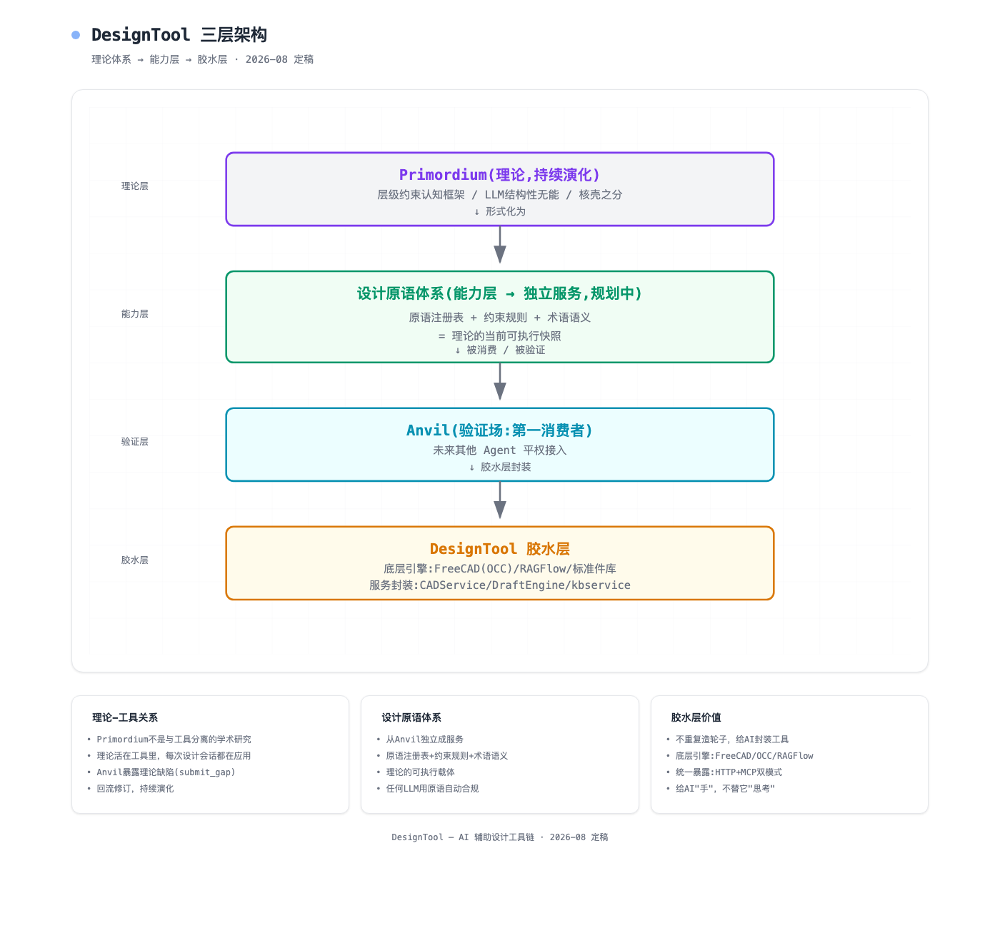

# DesignTool

**一种与 LLM 本质不同的机械智能。**

[](./LICENSE)

> **主仓库（upstream）在 GitHub**：https://github.com/wenhao0918/designtool ；[Gitee](https://gitee.com/deng-wenhao/designtool) 为国内访问镜像。Issue / PR 请提交到主仓库。

DesignTool 是一个自然语言驱动的机械设计工具：你说"做一块 100×60×10 的底板，四角打 Φ8 贯穿孔，孔心距边 10"，它给出可制造的三维实体（STL/STEP）、可下载的工程图纸，以及一份每一步都可回放的设计过程记录。

**机构是算出来的。**机械设计的本质是约束满足计算——几何约束（贴边、间隙、对齐）、物理约束（不干涉、不悬空）、拓扑约束（连接、装配关系）；解存在则设计成立，无解则欠约束，没有概率的余地。LLM 是概率语言模型，没有空间心象、不会带物理含义的算术、同一输入每次漂移——**原理上做不了机械设计**。它擅长的是语言：DesignTool 由此定分工——LLM 只担任翻译岗，把人话译成纯数字矩阵（ΔQ）与约束（如"距边 10mm"），空间推理全部交给 Primordium 内核（拓扑心象 + 约束求解 + 几何谓词），**解题的从来不是它**。这与"LLM 直接生成 CAD"是两条路线：概率侧会猜、会漂、错了不知道错；DesignTool 把智能放在确定性一侧——预注册译码表、矩阵化需求账本、参数定长协议、几何校验闸门。由此换来四个工程性质：

- **可复算**：同一需求序列每次得到同一模型，结果可作为函数验证
- **可追溯**：每条指令落账为带唯一序号的需求增量（指称永不复用），模型能回溯到任一步的原始指令
- **可回滚**：任意步撤销/重做/清零归档，设计历史是账本而非对话记录
- **可校验**：违反几何常识的操作（刀具切空、引用不存在的对象、参数错位）在闸门层显式报警，不静默出错

> 类比：Git 不是编程语言，但让代码协作成为可能；DesignTool 不是 CAD，但让设计求解成为可能。

设计过程本身也是产品：内置演示回放（打字机指令 + 解说配音 + 3D 生长动画），可从任意真实项目一键生成"设计是怎么做出来的"教学脚本。

工程上它刻意做成**弱模型友好**：译码协议定长、参数表经工具查询（LLM 零记忆）、指称锚外置于系统数据结构、格式漂移自动防御重译——普通公有云大模型即可驱动，换更强的模型只会更好，系统不需任何适配。

当前处于原型阶段（内核 V0.x），三层架构（壳 → Primordium 框架 → 工具）与理论文档随代码同步演化，全程由国标知识库背书，欢迎在 Issue 区提交理论缺口与工程缺陷。

## 为什么需要它

当前"LLM + CAD"方案普遍存在四个问题：同一需求多次生成结果不同（不可复算）、违反物理与制造约束不可知（错误静默潜伏）、设计结果无法追溯至需求（责任链断裂）、无法精确回滚。DesignTool 用确定性内核取代概率生成——**强约束只输出"已证明遵守"或"已证明不可达"两类结论**，每一步都能复算与回放。

## 核心特性

- **确定性求解（机械智能内核）**：需求以矩阵增量落账（Q′ = Q + ΔQ），约束装配后唯一解——同一需求每次得到同一模型，结果可作数学函数验证
- **会话式设计（入口便利）**：一个项目一个会话，增量修改不清空重建，任意步回滚
- **知识驱动**：建模前自动检索国标（如 GB/T 系列），参数标注附依据，无标准依据时如实声明、不编造
- **设计意图保护**：自动检测后续修改是否"吞没"你早期登记的设计意图，漂移即报警并给出修复候选
- **出图闭环**：STEP → 三视图 SVG/PDF/FCStd，流式进度，技术要求与材料推荐
- **3D 预览**：STL（three.js）+ STEP（浏览器内 OpenCascade wasm，精确 BREP）
- **健壮性**：上下文压缩、对话恢复、工具异常兜底自纠

## 工作原理：LLM 只译码，不设计

```
自然语言指令 ──LLM 译码──▶ 码序列（纯数字串）──文法校验──▶ ΔQ 落账（Q′ = Q + ΔQ）──约束装配/演算──▶ 唯一解
```

- **预注册译码表**（[`Anvil/anvil/encoder/codetable.py`](./Anvil/anvil/encoder/codetable.py)）：编号 ↔ DSL 词汇 ↔ 底层实现三层对齐（1~99 体元、100+ 布尔/修饰/变换算子……编号永不复用）。LLM 没有自由生成空间——表里没有"空心球"，它只能译出"球 − 球"
- **LLM 只输出一串数字**（[encoder.py](./Anvil/anvil/encoder/encoder.py)）：禁止 JSON/括号/解释；无法映射的词输出 `9999` 报警，数字串交由内核盲扫描执行
- **三级译码上下文**：译码表主词精确直译 → 术语别名归一（"圆球"→"球"）→ RAG 语义检索拆解复合词
- **架构理念**：系统的全部智能在确定性侧——文法、矩阵、算子库；LLM 的岗位是查词典+填参数。因此翻译正确率可测量，求解结果可复算

理论展开：[约束场与机械智能](./约束场与机械智能.md) · [理论根基](./理论根基.md)

## 架构

**壳 → 框架 → 工具，智能在框架层。** LLM 与 CAD 内核都是外设：一个管听懂人话，一个管出实体。

1. **壳（前端 · Anvil 会话）** —— 人机界面与译码入口，不承载智能
2. **框架（Primordium 求解内核）** —— Q/S 双矩阵账本 + ΣΠΔΩ 内核 + τ 工具面 + 文法词表的唯一权威：机械智能所在
3. **工具（设计原语与外部服务）** —— 几何内核、知识库、RAG 等能力载体，可替换、不越权

理论不是纸上研究：Anvil 的每次真实设计会话都在使用当前理论、暴露理论缺陷并回流修订（submit_gap 机制）。



### 服务清单

| 服务 | 端口 | 职责 | 暴露 |
|---|---|---|---|
| **frontend** | 5174 | Vue3 统一界面（设计会话/工具箱/3D 预览） | — |
| **Anvil** | 8095 | AI 设计 Agent：会话式增量建模 + 国标知识库工具 | HTTP |
| **AdminService** | 8097 | 认证/用户/日志 | HTTP |
| **CADService** | 8102 | FreeCAD 载体工具（常驻免冷启动） | HTTP+MCP |
| **DraftEngine** | 8100 | STEP→工程图纸（三视图/标注/国标合规自检） | HTTP+MCP |
| **kbservice** | 8101 | 知识联邦查询（国标/术语/标准件） | HTTP |
| SketchService | 8096 | 手绘识别 | HTTP |
| OcrService / VoiceService | 8099/8098 | OCR / 语音 | HTTP |

**MCP 统一约定**：全家族采用 fastapi-mcp（经 `mcp_helper.py`），工具名按 operation_id 规范化（如 `execute_freecad` / `generate_drawing_stream`）。

### 调用关系

```
用户 → frontend(5175) →┬─ Anvil(8095) · 设计会话/Agent ─────────────┐
                        │                                            │
                        │   Anvil 出向依赖:                          │
                        │   ├→ CADService(8102) FreeCAD 建模执行     │
                        │   │    └→ FreeCAD(freecad-python3/OCC)     │
                        │   │       (失败降级本地 subprocess)         │
                        │   ├→ kbservice(8101) 国标检索/合规          │
                        │   │    ├→ RAGFlow(1800) 向量/图谱 ←─ 知识资产本体
                        │   │    ├→ Anvil(8095) 术语代理(/api/terms,  │
                        │   │    │         JWT 由 AdminService 8097)  │
                        │   │    └→ 标准件库(8080 mn-material,经Anvil)│
                        │   ├→ AdminService(8097) 登录认证            │
                        │   ├→ SketchService(8096) 手绘识别           │
                        │   └→ dtwin(8092) 数字孪生校核               │
                        │                                            │
                        ├─ DraftEngine(8100) · 出图 ─────────────────┤
                        │   DraftEngine 出向:                         │
                        │   ├→ FreeCAD(OCC,HLR 投影/特征识别)         │
                        │   ├→ kbservice(8101) 自带 kb.py→RAGFlow     │
                        │   └→ VLM(moonshot) 标注决策(auto 管线)      │
                        │                                            │
                        └─ 工具箱直达:OCR(8099)/语音(8098)/           │
                           DraftEngine(工程画图)/标准件查询            │
                                                                     │
外部 AI 客户端(Claude/Cursor/Dify) ──MCP──→ CADService/DraftEngine ──┘
```

要点：

- **CADService 是几何工具唯一入口**（建模流量全走它，失败自动降级本地执行）
- **kbservice 是知识唯一入口**（国标/术语/标准件联邦查询，业务数据留在业务库）
- **MCP 旁路开放**：外部 AI 客户端可绕过 frontend/Anvil 直连 CADService/DraftEngine 的 `/mcp`

## 设计原则

1. **无意取代成熟开源工具**（FreeCAD/OpenSCAD）——在其上叠加信息层
2. **表达更多信息/语义/意图**——几何之外的设计上下文（为什么/约束/迭代）
3. **便于 AI 处理理解**——输出结构化可解析描述，AI 能「理解」设计

## 目录结构

```
DesignTool/
├── Primordium/      框架层文档（结构定义/设计语言演算/指令矩阵表示/Q定义/语义数值映射）+ 理论档案
├── Anvil/           AI 设计 Agent
├── CADService/      FreeCAD 载体工具（HTTP+MCP；执行层在 Primordium Ω）
├── DraftEngine/     工程图纸生成（HTTP+MCP）
├── KnowledgeBase/   知识服务（联邦查询）
├── AdminService/    认证与管理
├── frontend/        Vue3 前端
├── SketchService/   手绘识别
├── ParamDerive/     参数推导
├── OcrService/ VoiceService/ Zhiyin/ TraceTool/
└── mcp_helper.py    fastapi-mcp 统一挂载器
```

根目录的总体蓝图/理论/知识溯源等全局设计文档（约束场设计系统_总体蓝图、技术框架规划、理论根基、知识溯源方法论、约束场与机械智能、导读等）描述了体系背后的完整理论。

## 运行

各服务为独立 Python/Vue 进程，可分别启动（如 tmux 多会话）；前端本地开发用 vite（端口代理见 `frontend/vite.config.ts`）。详细说明见 [GUIDE.md](./GUIDE.md) 与各服务目录的 README。

**想先看效果？** [`demo/`](./demo) 是自包含的确定性求解演示（两个专利实施例 · Docker 一键跑 · 含 3D 预览）。

## 环境变量

服务经环境变量配置，`.env` 文件不入库（见 `.gitignore`）。核心清单：

**LLM / 模型**

| 变量 | 用途 |
|---|---|
| `ANVIL_LLM_BASE_URL` / `ANVIL_LLM_API_KEY` / `ANVIL_MODEL` | Anvil 推理模型（OpenAI 兼容） |
| `ANVIL_VISION_BASE_URL` / `ANVIL_VISION_API_KEY` / `ANVIL_VISION_MODEL` | 视觉模型（手绘识别等） |
| `VITE_LLM_INFERENCE_KEY` / `VITE_LLM_VISION_KEY` | 前端 SketchPad 默认模型 Key（`frontend/.env.local`，可留空后在界面设置） |

**认证 / 数据**

| 变量 | 用途 |
|---|---|
| `ANVIL_JWT_SECRET` | JWT 签名密钥（Anvil 与 AdminService 共享；**生产必须修改**，开发态有默认值） |
| `ANVIL_DB_URL` | MySQL 连接串（`anvil` 库） |
| `ANVIL_DATA_DIR` | 项目数据目录 |
| `ANVIL_ENV` | 运行环境标记 |

**外部服务对接**

| 变量 | 用途 |
|---|---|
| `MN_AUTH_HOST` / `MN_AUTH_PORT` | RuoYi 兼容认证服务地址（默认 `127.0.0.1:8080`，内置客户端见 `utils/matNgineClient.py`） |
| `MN_AUTH_USER` / `MN_AUTH_PASSWORD` / `MN_AUTH_CLIENT_ID` / `MN_AUTH_PUBLIC_KEY` | 认证凭证（无默认，需显式提供） |
| `RAGFLOW_URL` / `RAGFLOW_API_KEY` / `RAGFLOW_DATASET_GRAPH` | RAGFlow 知识库 |
| `CADSERVICE_URL` / `SKETCH_SERVICE_URL` / `GBSTD_SERVICE_URL` / `MATERIAL_PROXY_BASE` / `ANVIL_API` | 各服务互联地址 |
| `VOICE_WHISPER_MODEL` | 语音转写模型（默认 tiny） |
| `PD_MCP_PORT` | ParamDerive MCP 端口 |

## 许可证与专利

本项目的全部代码与文档以 **Apache License 2.0** 发布，详见 [LICENSE](./LICENSE)。

本项目核心方法已提交中国发明专利申请（patent pending）。依据 Apache-2.0 第 3 条，使用者获得相应专利授权；专利声明详见 [NOTICE](./NOTICE)。

> **第三方边界**：ruoyi-cloud-plus 及其衍生模块（mn-anvil 等）存放于独立私有仓库，不属于本项目、不在本项目许可范围。本仓库不包含、也不再分发任何第三方软件的实现。

## 贡献

欢迎贡献代码、术语库/结构模板/标准件数据与设计案例。提交 PR 即表示你同意以 Apache-2.0 授权你的贡献。
